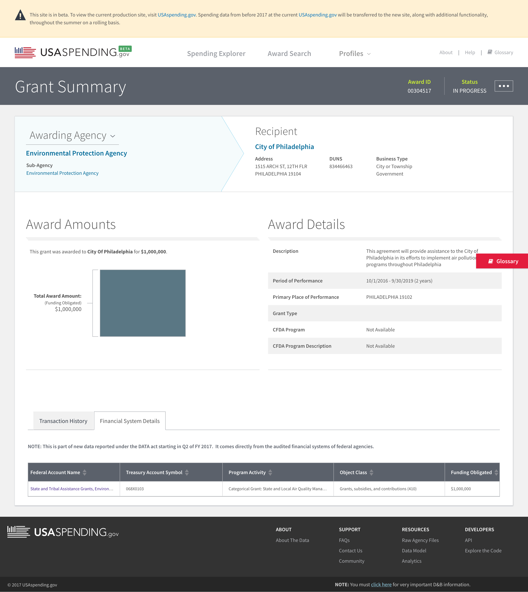
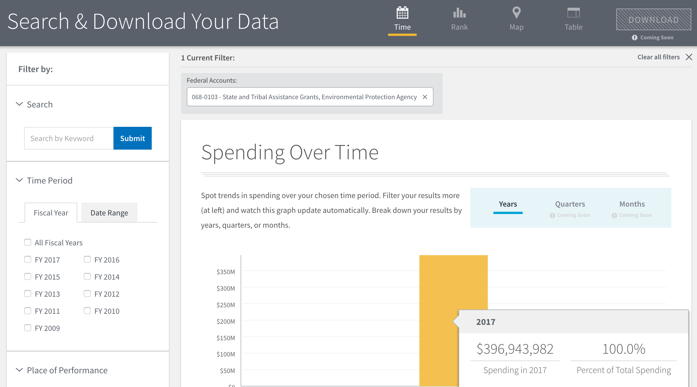
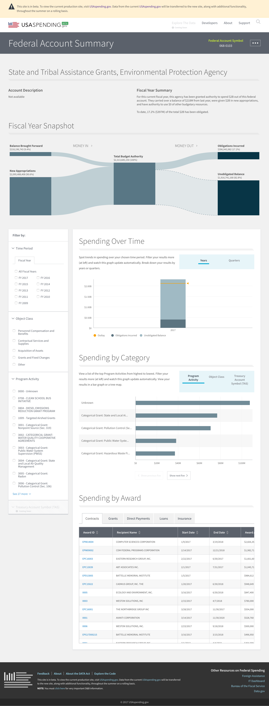
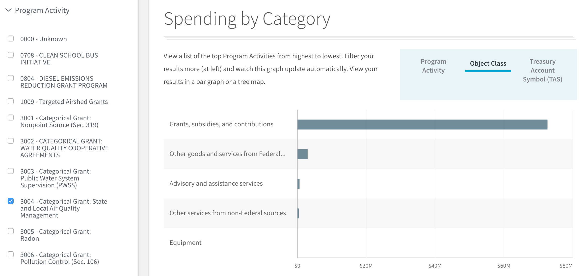
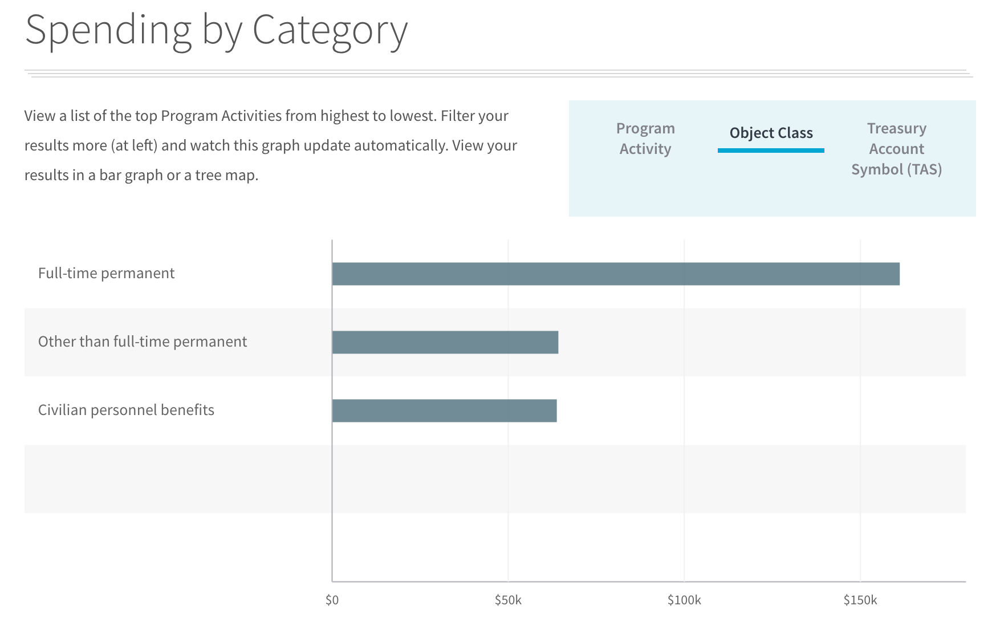

# U.S. Federal Spending: The Big Picture

On May 9, 2017, the U.S. Department of the Treasury released the first batch of spending data that U.S. agencies submitted under the DATA Act, a 2014 law that requires:

1. More comprehensive reporting of federal spending data.
2. A data standard that agencies must use when submitting this information.

This is what you might call a BFD.


## TL;DR

If you don't want to follow these meanderings around the new [beta.usaspending.gov](https://beta.usaspending.gov "USAspending.gov beta") website, here are the quick takeaways:

1. The scope of data on the beta site is much larger than its predecessor, which doesn't include large categories of spending like interest on the debt and salaries
2. You can now explore the top of the federal spending hierarchy and work your way down to individual award transactions.
3. [Here's a .csv](https://github.com/bsweger/fedspending-scripts/blob/master/data/data_act_account_ocpa.csv) of outlays and obligations incurred by account, program activity, and object class as of FY 2017 Q2.


## More Comprehensive Reporting

To understand magnitude of the May 9 release, consider this diagram lifted from the new [beta.usaspending.gov website](https://beta.usaspending.gov/#/about) about what you can see there:


### Pre-DATA Act

Here's the part of the spending hierarchy that you can see on the pre-DATA Act USAspending.gov website:


Other parts were available in bits and pieces but weren't public, searchable, and machine-readble. Furthermore, those bits and pieces didn't link to other parts of the hierachy, making it impossible to get the full picture.


## Awards don't tell the whole story

Nothing against awards data. It's useful. Awards describe grants, contracts, and loans. This category of federal spending also includes information about payments the U.S. government makes on behalf of individuals, like Social Security and Medicare payments. Awards are a terrific way to understand how our collective tax dollars flow back into our communities.

For example, [here's a grant](https://beta.usaspending.gov/#/award/982394) that Philadelphia, PA received from the Environmental Protection Agency to _provide assistance to the City of Philadelphia in its efforts to implement air pollution control programs_.



Interesting! But not new. We can [see this type of information on the legacy usaspending.gov website](https://www.usaspending.gov/transparency/Pages/TransactionDetails.aspx?RecordID=AE0369E2-553B-4A64-B837-EF052A246635&AwardID=55867825&AwardType=G).

Also! Awards data comes from the day-do-day systems that agencies use to manage their contracts, grants, loans, etc. **It does not represent data from an audited financial system.**


## Going up the hierarchy

The DATA Act achieves what fedspending data nerds sometimes call the "golden spike": the linkage of an award back to the federal account that funds it. See the _Financial System Details_ tab down there at the bottom of the award page? That's the golden spike.


Notice this sentence: _It comes directly from the audited financial systems of federal agencies_.

Now we see can see that the reported $1,000,000 grant amount matches the $1,000,000 amount being reported by the EPA's audited financial system.


## Program Activity and Object Class

Furthermore, the _Financial Systems Details_ view of the awards data (shown above) gives us the linkages we need to trace an award up to the level immediately above it in the spending hierarchy:

1. [Program activity](http://fedspendingtransparency.github.io/whitepapers/programactivity/ "program activity") = `Categorical Grant:  State and Local Air Quality Management`
2. [Object class](http://fedspendingtransparency.github.io/whitepapers/objectclass/ "object class") = `Grants, subsidies, and contributions`

Program activity and object class are two separate (but sometimes complementary) ways of categorizing the spending information stored in agency financial systems. Let's consider them in the context of that EPA grant to Philadelphia.

The object class isn't super interesting, because we already know we're looking at a grant.  What _is_ interesting is program activity. We can see that this grant is part of a larger bucket of spending for a program called `State and Local Air Quality`.

This is already more information than we could have extracted from the current usaspending.gov, which doesn't provide any way to understand an individual award in the context of the greater spending landscape.

### Program Activity: a brief technical aside

Beta.usaspending.gov is in...beta. Thus, there's currently no easy way to look up everything related to a specific program activity. (hint: there's [community forum](https://usaspending-help.zendesk.com/hc/en-us/community/topics "beta.usaspending.gov community forum") where you can do your patriotic duty by suggesting improvements and features).

That said, you can get geeky and use the [USAspending API](https://api.usaspending.gov/) to follow the trail. The API (application programming interface) is the behind-the-scenes way that the website retrieves data. Luckily, the API not only powers the website: it's also available for the public to query.

For example: this strange-looking link to the USAspending API requests a list of awards that belong to the `State and Local Air Quality` program activity. The code below shows how you can use the API to get the details of these awards and, as a result, a better sense of `State and Local Air Quality` spending.

[https://api.usaspending.gov/api/v1/accounts/awards/?program_activity__program_activity_name=Categorical%20Grant:%20%20State%20and%20Local%20Air%20Quality%20Management&limit=500](https://api.usaspending.gov/api/v1/accounts/awards/?program_activity__program_activity_name=Categorical%20Grant:%20%20State%20and%20Local%20Air%20Quality%20Management&limit=500)

```python
# For those interested in the API, here's an example of displaying that list of
# all awards with the "State and Local Air Quality" program activity classification

import json
import requests
import pandas as pd
from pandas.io.json import json_normalize

uri = 'https://api.usaspending.gov/api/v1/accounts/awards/?program_activity__program_activity_name=Categorical%20Grant:%20%20State%20and%20Local%20Air%20Quality%20Management&limit=500'
r = requests.get(uri)
air_awards  = pd.DataFrame(json_normalize(r.json()['results']))


# This is pretty good, but we can can show better info by using the award identifiers
# in the air quality award list to grab some additional details about each item
award_list = air_awards['award'].tolist()
uri = 'https://api.usaspending.gov/api/v1/awards/'
headers = {'content-type': 'application/json'}
payload = {
    "limit": 500,
    "fields": [
        "id", "total_obligation", "description", "type", "type_description",
       "fain", "piid", "uri", "recipient", "place_of_performance"],
    "filters": [{"field": "id", "operation": "in", "value": award_list}]
}
r = requests.post(uri, data=json.dumps(payload), headers=headers)
air_award_details = pd.DataFrame(json_normalize(r.json()['results']))

air_merged = pd.merge(air_awards, air_award_details, left_on='award', right_on='id')
# as an example, just show the first few awards
air_merged[[
    'type_description', 'recipient.recipient_name', 'recipient.location.city_name',
    'program_activity.program_activity_code', 'program_activity.program_activity_name',
    'treasury_account.federal_account.account_title'
    ]].head(4)
```
The code above generates a dataset that looks like this (headers abbreviated for brevity):

| type | recipient name | recipient city | pgm actv code | pgm actv name | account title |
| ---- | -------------- | -------------- | ------------- | ------------- | ------------- |
| Project Grant | CO Department of Public Health and Environment | DENVER | 3004 | Categorical Grant:  State and Local Air Qualit... | State and Tribal Assistance Grants, Environmen... |
| Formula Grant | South Coast AQMD | DIAMOND BAR | 3004 | Categorical Grant:  State and Local Air Qualit... | State and Tribal Assistance Grants, Environmen... |
| Project Grant | STATE OF OHIO OFFICE OF BUDGET AND MANAGEMENT | COLUMBUS | 3004 | Categorical Grant:  State and Local Air Qualit... | State and Tribal Assistance Grants, Environmen... |
| Delivery Order | ICF INCORPORATED, L.L.C. | FAIRFAX	 | 3004 | Categorical Grant:  State and Local Air Qualit... | State and Tribal Assistance Grants, Environmen... |


### Program Activity: but what does this tell us?

We've now followed a single award up the federal spending chain to get a list of other awards that are funded from that same `State and Local Air Quality` program. Some of these awards are grants, similar to the one that went to Philly. Others are contracts that appear to be program-related services like [air monitoring equipment](https://beta.usaspending.gov/#/award/984045) and [databases](https://beta.usaspending.gov/#/award/983715).

We had to dig into the API to do this, but I suspect the website itself will eventually support this type of sleuthing (the team releases new features bi-weekly).

The resulting list gives us a better picture of the overall reach of the program. In this first DATA Act reporting period, the EPA made ~150 `State and Local Air Quality` awards.

### Awards don't tell the whole story, Part II

But again, _awards_ spending is only part of the picture. Presumably there are other costs to running the `State and Local Air Quality` program. To find those, we have to go up another level in the spending hierarchy.


## Federal Accounts

Loosely speaking, a federal account represents a high-level grouping of specific, related Treasury accounts. Simplistically, you can think of Treasury accounts as funds that correspond to Congress authorizations to spend money for specific purposes.

### Search for an account

In the table of air quality grants that we got from the API, you can see that all of them are associated with a federal account titled `State and Tribal Assistance Grants, Environmental Protection Agency`.

Now that we know this title, we can look it up on the [search page of beta.usaspending.api](https://beta.usaspending.gov/#/search "USAspending search").



The result of that search will be a view of the money obligated for of this specific account: $369,943,892, for fiscal year 2017 to date.

(An _obligation_ means that money has been set aside for a designated purpose, to be paid later.)


### View an account

It's not immediately obvious, but the search results page lets you jump right to the _Federal Accounts_ level of the spending hiearchy. Look for the _Spending by Budget Category_ chart and choose the _Federal Accounts_ view to see spending by federal account.


In this case, you'll only see one account, because we only searched for one. What you want is that hyperlink on the y axis: https://beta.usaspending.gov/#/federal_account/1752

Click it for a high-level view of activity for the entire account: not just awards spending.



You're now looking at the _Federal Account Summary_ page, which displays the details of an individual federal account:

* balances for the current fiscal year
* spend by program activity and object class
* individual awards that have been funded from the account

### Filter an account

Back to our original EPA air quality award to Philadelphia and the `State and Tribal Assistance Grants, Environmental Protection Agency` program that funds it.

The _Federal Account Summary_ page lets you drill into a federal account by any combination of program activity codes and object classes. Thus, to better understand the **overall** spending for `State and Tribal Assistance Grants, Environmental Protection Agency` (not just grants), you would:

1. Filter by the `State and Tribal Assistance Grants, Environmental Protection Agency` program activity (left-hand side of the screen)
2. Switch the _Spending by Category_ graph to the _Object Class_ view

Now you have the high-level categories of spending for this program.



You can switch up the filters on the left-hand side of the screen to explore the other programs and object classes that compose the `State and Tribal Assistance Grants, Environmental Protection Agency` account. For example, filtering on the _Peronnel Compensation and Benefits_ object class shows that less than 1% of this account's obligated funds go towards salaries and benefits.





## Why go up the hierarchy?

Many of us view federal spending solely from the perspective of award data, because it's all we've had access to in a convenient, machine-readable format.

Before the DATA Act, the only thing we could see was the $1,000,000 grant to City of Philadelphia. Post-DATA Act, we have the context that federal spending nerds have dreamed of for decades:

* So far in fiscal year 2017, we've obligated $20.4 billion within the `Natural Resources` budget function
* Of that, 2% ($397 million) has been obligated within the  `State and Tribal Assistance Grants, Environmental Protection Agency` federal account
* 19% of those obligations ($76.8 million) go towards the `State and Local Air Quality` program
* And 2% of that ($1 million) ended up being obligated as a grant to the city of Philadelphia

Some people will use this information to better understand how our tax dollars fund the services we use every day. Some will use it to look for duplication and waste. Some will use it to track spending for the programs they manage. Some will use it to surface areas for continued data improvement.

Whatever your angle, May 9, 2017 saw a huge step forward.


